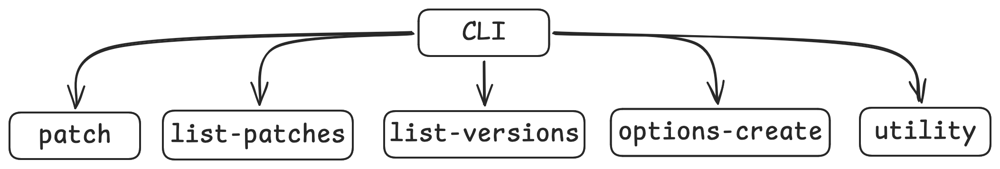

<h1 align="center">🛠️ Morphe Desktop Documentation</h1>

This is the complete documentation for Morphe Desktop. It covers all the CLI sub-commands, flags, GUI usage
and common workflows. If you're brand new, it is recommended to start with the [first-run](../README.md#first-run) section
and then come back here.

Now that you have gone through with your first run, lets dig deeper to understand how the magic happens and how you can make it even better!

<h2 id="table-of-contents">Table of contents</h2>

- [Prerequisites](#prerequisites)
- [CLI](#cli)
  - [General flags](#general-flags)
  - [Where Morphe stores its files](#where-files-stored)
  - [patch](#subcommand-1-patch)
  - [list-patches](#subcommand-2-list-patches)
  - [list-versions](#subcommand-3-list-versions)
  - [options-create](#subcommand-4-options-create)
  - [utility](#subcommand-5-utility)
    - [install](#utility-install)
    - [uninstall](#utility-uninstall)
  - [Value Types Reference](#value-types-reference)
- [GUI](#gui)
  - [The two modes](#gui-modes)
  - [The window at a glance](#gui-window)
  - [Quick mode](#gui-quick)
  - [Expert mode](#gui-expert)
  - [Settings](#gui-settings)
  - [Tools](#gui-tools)
  - [Installing to a device](#gui-adb)
- [Building](#building)


<h2 id="prerequisites">Prerequisites</h2>

1. [Required] Java Runtime Environment 21 or above ([Azul Zulu JRE](https://www.azul.com/downloads/?version=java-21-lts&package=jre#zulu), [Temurin](https://adoptium.net/temurin/releases?version=21&os=any&arch=any) or [OpenJDK](https://jdk.java.net/archive/)).
2. [Required] Morphe Desktop jar file (morphe-desktop-*-all.jar). You can download the most recent stable version of Morphe Desktop from [here](https://github.com/MorpheApp/morphe-cli/releases/latest).
3. [Required] Patches mpp file (patches-*.mpp). You can download the latest stable patch file from [here](https://github.com/MorpheApp/morphe-patches/releases/latest).
4. [Required] Desired app file (app.apk). You can download your apk from [APK Mirror](https://www.apkmirror.com/).
5. [Optional] [Android Debug Bridge (ADB)](https://developer.android.com/studio/command-line/adb) Only if you want to install the patched APK file on your device directly from your computer.


<h2> CLI</h2>

The CLI suite is an extremely powerful tool.
It has some general flags but is mainly divided into 5 main sub-commands (and they all lived in harmony, until the fire nation attacked. Caught that reference?):



### General flags:

#### 1. `-h`, `--help`:

Shows all the general flags and sub commands available.
```
java -jar morphe-desktop-*-all.jar --help
```

#### 2. `-V`, `--version`:

Shows the current version of the morphe-desktop.jar
```
java -jar morphe-desktop-*-all.jar --version
```

<h3 id="where-files-stored">Where Morphe stores its files</h3>

Morphe keeps its runtime data: cached patch files, logs, scratch space for patching, and the default signing keystore in a single **`morphe-data/`** folder. By default this folder is created **next to the JAR** you run, so it survives upgrades and is easy to find. If that location isn't writable (e.g. running from an IDE, or from a read-only install path), Morphe falls back to **`~/morphe/`**. The startup logs print which one is in use (look for `Morphe data root: ...`).

```
morphe-data/
  patches/         # .mpp files downloaded from GitHub URLs
  logs/            # application logs
  tmp/             # per-run scratch space + cached .mpp URL downloads
  morphe.keystore  # shared default signing key (see --keystore)
  config.json      # GUI preferences
```

Several flag defaults below: notably `--temporary-files-path` and `--keystore` point inside this folder.

<h3 id="subcommand-1-patch">Subcommand 1: <code>patch</code></h3>

This is the most fundamental sub-command. Add the `patch` keyword to run this sub-command.
```
java -jar morphe-desktop-*-all.jar patch [flag/s]
```

Here is a quick lookup for all the flags under this subcommand:

| Flag                           | Description                                                                    |
|--------------------------------|--------------------------------------------------------------------------------|
| `-p`, `--patches`              | Paths to .mpp files or GitHub or GitLab repo URLs (repeatable, one per bundle) |
| `--prerelease`                 | Fetch latest dev pre-release instead of stable release                         |
| *(positional arg)*             | APK file to patch                                                              |
| `-o`, `--out`                  | Path to save the patched APK to                                                |
| `-e`, `--enable`               | Enable a patch by name                                                         |
| `--ei`                         | Enable a patch by index                                                        |
| `-d`, `--disable`              | Disable a patch by name                                                        |
| `--di`                         | Disable a patch by index                                                       |
| `-O`, `--options`              | Set patch option values (e.g. `-Okey=value`)                                   |
| `--exclusive`                  | Disable all patches except explicitly enabled ones                             |
| `-f`, `--force`                | Skip APK version compatibility check                                           |
| `-i`, `--install`              | Install to ADB device (optional serial)                                        |
| `--mount`                      | Install by mounting over existing app (requires root)                          |
| `--keystore`                   | Path to keystore file for signing                                              |
| `--keystore-password`          | Keystore password                                                              |
| `--keystore-entry-alias`       | Alias of the key pair in the keystore                                          |
| `--keystore-entry-password`    | Password for the keystore entry                                                |
| `--signer`                     | Signer name in the APK signature                                               |
| `--unsigned`                   | Skip signing the final APK                                                     |
| `-t`, `--temporary-files-path` | Path to store temp files                                                       |
| `--purge`                      | Delete temp files after patching                                               |
| `--custom-aapt2-binary`        | Deprecated. No effect, will be removed in a future release                     |
| `--force-apktool`              | Deprecated. No effect, will be removed in a future release                     |
| `--striplibs`                  | Architectures to keep, comma-separated (e.g. `arm64-v8a,x86`)                  |
| `--bytecode-mode`              | Bytecode mode: `FULL`, `STRIP_SAFE`, or `STRIP_FAST`                           |
| `--verify-with-sdk`            | Verify the patched DEX/APK using an Android SDK                                |
| `--continue-on-error`          | Continue patching if a patch fails                                             |
| `--options-file`               | Path to options JSON file                                                      |
| `--options-update`             | Auto-update options JSON file after patching                                   |
| `-r`, `--result-file`          | Path to save patching result JSON                                              |

> [!NOTE]
> The examples used for each flag below only show the usage of that specific flag, but in practice, you'll almost always combine multiple flags together to customize your patching. Here's an example of a more complete command:
> ```
> java -jar morphe-desktop-*-all.jar patch -p patches.mpp -o your_app_patched.apk --striplibs arm64-v8a --force --continue-on-error -d "change package name" -d "spoof signature" "your_app.apk"
> ```


#### 1. `-p`, `--patches`:
Required: Yes

Default: -

This flag specifies the patch file(s) to apply to your APK. You can pass local `.mpp` file paths or a GitHub or GitLab repository URL, and you can repeat `-p` to combine several bundles in one run (see [Using multiple patch bundles](#using-multiple-bundles) below). When a URL is provided, Morphe automatically downloads the `.mpp` file from the latest release and caches it for future runs.
```
java -jar morphe-desktop-*-all.jar patch --patches patches-*.mpp your_app.apk
```

You can also pass a GitHub or GitLab repo URL:
```
java -jar morphe-desktop-*-all.jar patch --patches https://github.com/MorpheApp/morphe-patches your_app.apk
java -jar morphe-desktop-*-all.jar patch --patches https://gitlab.com/MorpheApp/morphe-patches your_app.apk
```

Or a specific release URL:
```
java -jar morphe-desktop-*-all.jar patch --patches https://github.com/MorpheApp/morphe-patches/releases/tag/v1.0.0 your_app.apk
```

<h5 id="using-multiple-bundles">Using multiple patch bundles</h5>

`-p` can be repeated to combine several `.mpp` bundles in a single run:
```
java -jar morphe-desktop-*-all.jar patch -p patches-a.mpp -p patches-b.mpp your_app.apk
```

The **name-based** selection flags (`-e`, `-d`, `-O`) apply to the bundle they follow. Each `-p` starts a new bundle, and the selections after it belong to that bundle until the next `-p`:
```
java -jar morphe-desktop-*-all.jar patch -p patches-a.mpp -e "A patch from bundle A" -p patches-b.mpp -d "A patch from bundle B" your_app.apk
```

**Index-based** selections (`--ei`/`--di`) are the exception. Their numbers refer to the combined list across all supplied bundles, not a single one. Run `list-patches` with the same set of `-p` files to see the combined numbering:
```
java -jar morphe-desktop-*-all.jar list-patches -p patches-a.mpp -p patches-b.mpp
```
Then enable/disable by those combined indices. The index points to a patch no matter which bundle it came from, so its position relative to each `-p` doesn't matter:
```
java -jar morphe-desktop-*-all.jar patch -p patches-a.mpp -p patches-b.mpp --ei 57 --di 12 your_app.apk
```


#### 2. `--prerelease`:
Required: No

Default: `false`

When using a GitHub or GitLab repo URL with `--patches`, fetch the latest dev pre-release instead of the latest stable release.
```
java -jar morphe-desktop-*-all.jar patch --patches https://github.com/MorpheApp/morphe-patches --prerelease your_app.apk
```


#### 3. Positional argument (APK file):
Required: Yes

Default: -

The APK file you want to patch. This is passed directly without a flag name, at the end of the command.
```
java -jar morphe-desktop-*-all.jar patch -p patches.mpp your_app.apk
```

> [!NOTE]
> Morphe also supports `.apkm`, `.xapk`, and `.apks` files (split APK bundles). If you pass one of these, Morphe will automatically merge the splits into a single APK before patching.


#### 4. `-o`, `--out`:
Required: No

Default: a subfolder named after the app, created next to the input APK – `<app>/<app>-Morphe-<appVersion>-patches-<patchesVersion>.apk`

Specify a custom output path for the patched APK.
```
java -jar morphe-desktop-*-all.jar patch -p patches.mpp -o /path/to/output.apk your_app.apk
```


#### 5. `-e`, `--enable`:
Required: No

Default: -

Enable a specific patch by its exact name. Can be used multiple times to enable several patches.
```
java -jar morphe-desktop-*-all.jar patch -p patches.mpp -e "Patch name" -e "Another patch" your_app.apk
```


#### 6. `--ei`:
Required: No

Default: -

Enable a specific patch by its index number. Can be used multiple times. Use `list-patches` to find the index of each patch.
```
java -jar morphe-desktop-*-all.jar patch -p patches.mpp --ei 1 --ei 5 your_app.apk
```


#### 7. `-d`, `--disable`:
Required: No

Default: -

Disable a specific patch by its exact name. Can be used multiple times.
```
java -jar morphe-desktop-*-all.jar patch -p patches.mpp -d "Patch name" your_app.apk
```


#### 8. `--di`:
Required: No

Default: -

Disable a specific patch by its index number. Can be used multiple times. Use `list-patches` to find the index of each patch.
```
java -jar morphe-desktop-*-all.jar patch -p patches.mpp --di 456 your_app.apk
```

> [!TIP]
> You can combine `-e`, `-d`, `--ei`, `--di` and `--exclusive` in the same command.
> ```
> java -jar morphe-desktop-*-all.jar patch -p patches.mpp --exclusive -e "Patch name" --ei 123 your_app.apk
> ```


#### 9. `-O`, `--options`:
Required: No

Default: -

Set option values for patches. Options are key-value pairs passed alongside patch enable flags. To set a value to null, omit the value.
```
java -jar morphe-desktop-*-all.jar patch -p patches.mpp -e "Patch name" -Okey1=value1 -Okey2=value2 your_app.apk
```

To set an option to null:
```
java -jar morphe-desktop-*-all.jar patch -p patches.mpp -e "Patch name" -Okey1 your_app.apk
```

> [!WARNING]
> Option values are typed. Setting a value with the wrong type can cause the patch to fail. Use `list-patches --with-options` to see the expected types.
>
> Common types: `string`, `true`/`false`, `123` (integer), `1.0` (double), `[item1,item2]` (list)


#### 10. `--exclusive`:
Required: No

Default: `false`

Disable all patches except the ones you explicitly enable with `-e` or `--ei`. Useful when you only want a specific set of patches applied.
```
java -jar morphe-desktop-*-all.jar patch -p patches.mpp --exclusive -e "Patch name" your_app.apk
```


#### 11. `-f`, `--force`:
Required: No

Default: `false`

Skip the APK version compatibility check. By default, Morphe will warn you and skip patches that aren't compatible with your APK's version. This flag forces all compatible patches to run regardless.
```
java -jar morphe-desktop-*-all.jar patch -p patches.mpp --force your_app.apk
```

> [!TIP]
> Patches are built for specific app versions. 
> If you're using versions that are newer or older than the recommended ones, Morphe will skip all the incompatible patches (which is almost all of them since the version don't match) by default. **Use `--force` to apply them anyway** - they may still work fine, especially on recent versions.


#### 12. `-i`, `--install`:
Required: No

Default: -

Automatically install the patched APK to a connected ADB device after patching.
```
java -jar morphe-desktop-*-all.jar patch -p patches.mpp -i your_app.apk
```
If no serial is provided, it installs to the first connected device. You can optionally specify a device serial.
```
java -jar morphe-desktop-*-all.jar patch -p patches.mpp -i SERIAL123 your_app.apk
```

> [!TIP]
> Make sure ADB is working before using this flag:
> ```
> adb shell exit
> ```


#### 13. `--mount`:
Required: No

Default: `false`

Install the patched APK by mounting it on top of the original app. Requires root access and the original app to be installed on the device.
```
java -jar morphe-desktop-*-all.jar patch -p patches.mpp -i --mount your_app.apk
```

> [!NOTE]
> Make sure you have root permissions:
> ```
> adb shell su -c exit
> ```


#### 14. `--keystore`:
Required: No

Default: the shared `morphe-data/morphe.keystore` (see [Where Morphe stores its files](#where-files-stored))

Path to a keystore file containing a private key and certificate pair to sign the patched APK with. If not specified, Morphe uses a single shared keystore in its data folder – auto-creating it on the first run and reusing it afterwards. Reusing one keystore is intentional: Android only lets you update an installed app with an APK signed by the **same** key, so a stable keystore means you can re-patch and reinstall over a previous build.
```
java -jar morphe-desktop-*-all.jar patch -p patches.mpp --keystore /path/to/keystore.bks your_app.apk
```

> [!NOTE]
> The patcher signs using **BKS** keystores. If you point `--keystore` at a **PKCS12** (`.p12`/`.pfx`) or **JKS** (`.jks`) file, Morphe auto-detects the format from the file's contents (not its extension) and converts a BKS copy to sign with. Your original keystore file is never modified.


#### 15. `--keystore-password`:
Required: No

Default: empty (no password)

Password to open the **keystore file** itself. Different from the key *entry* password (`--keystore-entry-password`). Morphe's auto-generated default keystore has an empty store password, so you typically only need this flag when supplying your own keystore that was created with one.
```
java -jar morphe-desktop-*-all.jar patch -p patches.mpp --keystore keystore.jks --keystore-password "mypassword" your_app.apk
```

> [!NOTE]
> The CLI and the Morphe Manager Android app share the same keystore defaults (alias `"Morphe"`, password `"Morphe"`), so a keystore generated by either tool works in the other without extra flags.


#### 16. `--keystore-entry-alias`:
Required: No

Default: `"Morphe"`

The alias of the private key entry inside the keystore.
```
java -jar morphe-desktop-*-all.jar patch -p patches.mpp --keystore keystore.jks --keystore-entry-alias "my-alias" your_app.apk
```


#### 17. `--keystore-entry-password`:
Required: No

Default: `"Morphe"`

Password for the specific keystore entry.
```
java -jar morphe-desktop-*-all.jar patch -p patches.mpp --keystore keystore.jks --keystore-entry-password "mypassword" your_app.apk
```


#### 18. `--signer`:
Required: No

Default: `"Morphe"`

The name of the signer embedded in the APK signature.
```
java -jar morphe-desktop-*-all.jar patch -p patches.mpp --signer "My Signer" your_app.apk
```


#### 19. `--unsigned`:
Required: No

Default: `false`

Skip signing the patched APK entirely. The output APK will not be signed and cannot be installed directly on a device without signing it separately.
```
java -jar morphe-desktop-*-all.jar patch -p patches.mpp --unsigned your_app.apk
```


#### 20. `-t`, `--temporary-files-path`:
Required: No

Default: `morphe-data/tmp/` next to the JAR (falls back to `~/morphe/tmp/`)

Path to a directory where Morphe stores temporary files during patching. This is also where downloaded .mpp files are cached when using URLs with `--patches`.
```
java -jar morphe-desktop-*-all.jar patch -p patches.mpp -t /tmp/morphe-temp your_app.apk
```


#### 21. `--purge`:
Required: No

Default: `false`

Delete the temporary files directory after patching is complete.
```
java -jar morphe-desktop-*-all.jar patch -p patches.mpp --purge your_app.apk
```


#### 22. `--custom-aapt2-binary`:
Required: No

Default: -

> [!WARNING]
> **Deprecated.** AAPT2 was only used through apktool, which has been replaced by ARSCLib – this flag now has no effect and will be removed in a future release. It's kept for backward compatibility with older scripts.
```
java -jar morphe-desktop-*-all.jar patch -p patches.mpp --custom-aapt2-binary /path/to/aapt2 your_app.apk
```


#### 23. `--force-apktool`:
Required: No

Default: `false`

> [!WARNING]
> **Deprecated.** apktool has been replaced by ARSCLib – this flag now has no effect and will be removed in a future release. It's kept for backward compatibility with older scripts.
```
java -jar morphe-desktop-*-all.jar patch -p patches.mpp --force-apktool your_app.apk
```


#### 24. `--striplibs`:
Required: No

Default: -

Comma-separated list of native library architectures to **keep**. All other architectures will be stripped from the APK, reducing file size.
```
java -jar morphe-desktop-*-all.jar patch -p patches.mpp --striplibs arm64-v8a,armeabi-v7a your_app.apk
```


#### 25. `--bytecode-mode`:
Required: No

Default: `STRIP_FAST`

Controls how Morphe processes the APK's bytecode (DEX) during patching. Trade-off between speed, output size, and safety.

| Value          | Description                                                                                                                  |
|----------------|------------------------------------------------------------------------------------------------------------------------------|
| `FULL`         | Rebuilds and includes all bytecode. Largest output, slowest, safest - use if you hit runtime issues with the stripped modes. |
| `STRIP_SAFE`   | Strips bytecode that is provably unused, while keeping anything reachable via reflection or dynamic loading.                 |
| `STRIP_FAST`   | Default. Aggressively strips unused bytecode for the smallest, fastest build. May break apps that rely on reflection.        |

```
java -jar morphe-desktop-*-all.jar patch -p patches.mpp --bytecode-mode FULL your_app.apk
```

> [!TIP]
> If a patched app crashes at startup or has odd missing-class errors, switch to `STRIP_SAFE` or `FULL` and see if it fixes things.

> [!NOTE]
> On Windows, Morphe currently forces bytecode mode to `FULL` regardless of what you pass to this flag (workaround for a platform-specific issue). The flag still works as expected on macOS and Linux.


#### 26. `--verify-with-sdk`:
Required: No

Default: - (verification is skipped)

Verify the patched DEX and APK files using a local Android SDK after patching. Helpful for catching corrupt output before installing on a device. Pass a path to your SDK install directory, or pass the flag with no value to let Morphe auto-discover one.
```
java -jar morphe-desktop-*-all.jar patch -p patches.mpp --verify-with-sdk /path/to/android-sdk your_app.apk
java -jar morphe-desktop-*-all.jar patch -p patches.mpp --verify-with-sdk your_app.apk
```

> [!NOTE]
> When you pass `--verify-with-sdk` without a path, Morphe resolves the SDK in this order:
> 1. `$ANDROID_HOME`
> 2. `$ANDROID_SDK_ROOT`
> 3. OS-default install location:
>    - macOS: `~/Library/Android/sdk`
>    - Windows: `~/AppData/Local/Android/Sdk`
>    - Linux: `~/Android/Sdk`
>
> If none of those resolve to a real SDK, Morphe errors out with a hint to either set one of the env vars or supply a path explicitly.


#### 27. `--continue-on-error`:
Required: No

Default: `false`

By default, patching stops on the first patch failure. This flag lets Morphe continue applying the remaining patches even if one fails.
```
java -jar morphe-desktop-*-all.jar patch -p patches.mpp --continue-on-error your_app.apk
```


#### 28. `--options-file`:
Required: No

Default: -

Path to a JSON file that controls which patches are enabled/disabled and their option values. Generate one using the `options-create` subcommand.
```
java -jar morphe-desktop-*-all.jar patch -p patches.mpp --options-file options.json your_app.apk
```

> [!NOTE]
> If the file you specify doesn't exist yet, Morphe will automatically generate one with default values at that path and use it for the current patch. This means you can skip `options-create` entirely - just pass a path to a non-existent file and Morphe will create it for you.

> [!TIP]
> The options file is great for repeatable patching. Generate it once (either with `options-create` or by letting `--options-file` auto-generate it), tweak it, and reuse it every time you patch.


#### 29. `--options-update`:
Required: No

Default: `false`

Automatically update the options JSON file after patching to reflect the current patches. Without this flag, the file is left unchanged. New patches get added, removed patches get cleaned up.
```
java -jar morphe-desktop-*-all.jar patch -p patches.mpp --options-file options.json --options-update your_app.apk
```


#### 30. `-r`, `--result-file`:
Required: No

Default: -

Path to save a JSON file containing the patching result, including which patches succeeded, which failed, and any error details.
```
java -jar morphe-desktop-*-all.jar patch -p patches.mpp -r result.json your_app.apk
```

---


<h3 id="subcommand-2-list-patches">Subcommand 2: <code>list-patches</code></h3>

Lists all available patches from the supplied MPP files. Useful for finding patch names, indices, compatible packages, and options before patching.
```
java -jar morphe-desktop-*-all.jar list-patches --patches patches.mpp [flag/s]
```

Here is a quick lookup for all the flags under this subcommand:

| Flag                             | Description                                            |
|----------------------------------|--------------------------------------------------------|
| `--patches`                      | Paths to .mpp files or GitHub or GitLab repo URLs      |
| `--prerelease`                   | Fetch latest dev pre-release instead of stable release |
| `-t`, `--temporary-files-path`   | Path to store temporary files                          |
| `--out`                          | Write patch list to a file instead of stdout           |
| `-d`, `--with-descriptions`      | Show patch descriptions                                |
| `-p`, `--with-packages`          | Show compatible packages                               |
| `-v`, `--with-versions`          | Show compatible versions                               |
| `-o`, `--with-options`           | Show patch options                                     |
| `-u`, `--with-universal-patches` | Include patches compatible with any app                |
| `-i`, `--index`                  | Show patch index                                       |
| `-f`, `--filter-package-name`    | Filter patches by package name                         |


#### 1. `--patches`:
Required: Yes

Default: -

One or more paths to .mpp patch files or GitHub or GitLab repository URLs to list patches from. When a URL is provided, Morphe downloads the .mpp file and caches it for future runs.
```
java -jar morphe-desktop-*-all.jar list-patches --patches patches.mpp
java -jar morphe-desktop-*-all.jar list-patches --patches https://github.com/MorpheApp/morphe-patches
```


#### 2. `--prerelease`:
Required: No

Default: `false`

When using a GitHub or GitLab repo URL with `--patches`, fetch the latest dev pre-release instead of the latest stable release.
```
java -jar morphe-desktop-*-all.jar list-patches --patches https://github.com/MorpheApp/morphe-patches --prerelease
```


#### 3. `-t`, `--temporary-files-path`:
Required: No

Default: `morphe-data/tmp/` next to the JAR (falls back to `~/morphe/tmp/`)

Path to a directory where Morphe stores temporary files, including cached .mpp downloads when using URLs with `--patches`.
```
java -jar morphe-desktop-*-all.jar list-patches --patches https://github.com/MorpheApp/morphe-patches -t /tmp/morphe-temp
```


#### 4. `--out`:
Required: No

Default: -

Write the patch list to a file instead of printing to stdout. Useful in environments where `>` redirection is not available.
```
java -jar morphe-desktop-*-all.jar list-patches --patches patches.mpp --out patches-list.txt
```


#### 5. `-d`, `--with-descriptions`:
Required: No

Default: `true`

Show the description of each patch. Enabled by default - use `--with-descriptions=false` to hide them.
```
java -jar morphe-desktop-*-all.jar list-patches --patches patches.mpp --with-descriptions=false
```


#### 6. `-p`, `--with-packages`:
Required: No

Default: `false`

Show the packages each patch is compatible with.
```
java -jar morphe-desktop-*-all.jar list-patches --patches patches.mpp --with-packages
```


#### 7. `-v`, `--with-versions`:
Required: No

Default: `false`

Show the compatible app versions for each patch. Requires `--with-packages` to be useful.
```
java -jar morphe-desktop-*-all.jar list-patches --patches patches.mpp --with-packages --with-versions
```


#### 8. `-o`, `--with-options`:
Required: No

Default: `false`

Show the configurable options for each patch, including their keys, types, default values, and possible values.
```
java -jar morphe-desktop-*-all.jar list-patches --patches patches.mpp --with-options
```


#### 9. `-u`, `--with-universal-patches`:
Required: No

Default: `true`

Include patches that are compatible with any app (universal patches). Use `--with-universal-patches=false` to only show patches targeting specific packages.
```
java -jar morphe-desktop-*-all.jar list-patches --patches patches.mpp --with-universal-patches=false
```


#### 10. `-i`, `--index`:
Required: No

Default: `true`

Show the index of each patch. The index can be used with `--ei` and `--di` in the `patch` subcommand.
```
java -jar morphe-desktop-*-all.jar list-patches --patches patches.mpp
```


#### 11. `-f`, `--filter-package-name`:
Required: No

Default: -

Only show patches that are compatible with the specified package name.
```
java -jar morphe-desktop-*-all.jar list-patches --patches patches.mpp --filter-package-name com.google.android.youtube
```


---

<h3 id="subcommand-3-list-versions">Subcommand 3: <code>list-versions</code></h3>


Lists the most common compatible app versions for the patches in the supplied MPP files. Useful for knowing which APK version to download before patching.
```
java -jar morphe-desktop-*-all.jar list-versions --patches patches.mpp [flag/s]
```

Here is a quick lookup for all the flags under this subcommand:

| Flag                           | Description                                            |
|--------------------------------|--------------------------------------------------------|
| `--patches`                    | Paths to .mpp files or GitHub or GitLab repo URLs      |
| `--prerelease`                 | Fetch latest dev pre-release instead of stable release |
| `-t`, `--temporary-files-path` | Path to store temporary files                          |
| `-f`, `--filter-package-names` | Filter by package names                                |
| `-u`, `--count-unused-patches` | Include unused patches in the version count            |


#### 1. `--patches`:
Required: Yes

Default: -

One or more paths to .mpp patch files or GitHub or GitLab repository URLs. When a URL is provided, Morphe downloads the .mpp file and caches it for future runs.
```
java -jar morphe-desktop-*-all.jar list-versions --patches patches.mpp
java -jar morphe-desktop-*-all.jar list-versions --patches https://github.com/MorpheApp/morphe-patches
```


#### 2. `--prerelease`:
Required: No

Default: `false`

When using a GitHub or GitLab repo URL with `--patches`, fetch the latest dev pre-release instead of the latest stable release.
```
java -jar morphe-desktop-*-all.jar list-versions --patches https://github.com/MorpheApp/morphe-patches --prerelease
```


#### 3. `-t`, `--temporary-files-path`:
Required: No

Default: `morphe-data/tmp/` next to the JAR (falls back to `~/morphe/tmp/`)

Path to a directory where Morphe stores temporary files, including cached .mpp downloads when using URLs with `--patches`.
```
java -jar morphe-desktop-*-all.jar list-versions --patches https://github.com/MorpheApp/morphe-patches -t /tmp/morphe-temp
```


#### 4. `-f`, `--filter-package-names`:
Required: No

Default: -

Only show versions for the specified package names. Can be used to check versions for a specific app.
```
java -jar morphe-desktop-*-all.jar list-versions --patches patches.mpp -f com.google.android.youtube
```


#### 5. `-u`, `--count-unused-patches`:
Required: No

Default: `false`

Include patches that are not enabled by default when calculating the most common compatible versions. By default, only patches that are enabled are counted.
```
java -jar morphe-desktop-*-all.jar list-versions --patches patches.mpp --count-unused-patches
```

---


<h3 id="subcommand-4-options-create">Subcommand 4: <code>options-create</code></h3>

Creates or updates an options JSON file for controlling which patches are enabled/disabled and their option values. The generated file can be passed to the `patch` subcommand with `--options-file`.
```
java -jar morphe-desktop-*-all.jar options-create [flag/s]
```

Here is a quick lookup for all the flags under this subcommand:

| Flag                           | Description                                            |
|--------------------------------|--------------------------------------------------------|
| `-p`, `--patches`              | Paths to .mpp files or GitHub or GitLab repo URLs      |
| `--prerelease`                 | Fetch latest dev pre-release instead of stable release |
| `-t`, `--temporary-files-path` | Path to store temporary files                          |
| `-o`, `--out`                  | Path to the output JSON file                           |
| `-f`, `--filter-package-name`  | Filter patches by package name                         |


#### 1. `-p`, `--patches`:
Required: Yes

Default: -

One or more paths to .mpp patch files or GitHub or GitLab repository URLs to generate options from. When a URL is provided, Morphe downloads the .mpp file and caches it for future runs.
```
java -jar morphe-desktop-*-all.jar options-create -p patches.mpp -o options.json
java -jar morphe-desktop-*-all.jar options-create -p https://github.com/MorpheApp/morphe-patches -o options.json
```


#### 2. `--prerelease`:
Required: No

Default: `false`

When using a GitHub or GitLab repo URL with `--patches`, fetch the latest dev pre-release instead of the latest stable release.
```
java -jar morphe-desktop-*-all.jar options-create -p https://github.com/MorpheApp/morphe-patches --prerelease -o options.json
```


#### 3. `-t`, `--temporary-files-path`:
Required: No

Default: `morphe-data/tmp/` next to the JAR (falls back to `~/morphe/tmp/`)

Path to a directory where Morphe stores temporary files, including cached .mpp downloads when using URLs with `--patches`.
```
java -jar morphe-desktop-*-all.jar options-create -p https://github.com/MorpheApp/morphe-patches -t /tmp/morphe-temp -o options.json
```


#### 4. `-o`, `--out`:
Required: Yes

Default: -

Path to the output JSON file. If the file already exists, Morphe will merge the current patches into it - preserving your existing settings, adding new patches, and removing patches that no longer exist.
```
java -jar morphe-desktop-*-all.jar options-create -p patches.mpp -o options.json
```

> [!TIP]
> Run this command again after updating your .mpp file to keep your options file in sync. Existing settings are preserved.


#### 5. `-f`, `--filter-package-name`:
Required: No

Default: -

Only include patches compatible with the specified package name in the generated options file.
```
java -jar morphe-desktop-*-all.jar options-create -p patches.mpp -o options.json -f com.google.android.youtube
```


#### Options JSON Workflow

The options JSON file lets you save your patch preferences and reuse them across multiple patching sessions. Here's the typical workflow:

**Step 1: Generate the options file**

Use `options-create` to generate a JSON file with all available patches and their default settings:
```
java -jar morphe-desktop-*-all.jar options-create -p patches.mpp -o options.json
```

**Step 2: Edit the file**

Open `options.json` in any text editor. You can enable/disable patches and set option values. The file contains a list of patch bundles, each with patch entries that look like:
```json
{
  "patchName": {
    "enabled": true,
    "options": {
      "optionKey": "optionValue"
    }
  }
}
```

Set `"enabled": false` to disable a patch, or change option values as needed.

**Step 3: Patch using the options file**

Pass your customized options file to the `patch` command:
```
java -jar morphe-desktop-*-all.jar patch -p patches.mpp --options-file options.json your_app.apk
```

**Step 4: Keep the file in sync (optional)**

When you update your .mpp file to a newer version, patches may be added or removed. You have two ways to sync:

- Re-run `options-create` - this merges new patches in while preserving your existing settings:
  ```
  java -jar morphe-desktop-*-all.jar options-create -p patches.mpp -o options.json
  ```

- Use `--options-update` during patching - this auto-updates the file after patching:
  ```
  java -jar morphe-desktop-*-all.jar patch -p patches.mpp --options-file options.json --options-update your_app.apk
  ```

> [!NOTE]
> CLI flags (`-e`, `-d`, `--ei`, `--di`, `-O`) always take precedence over the options file. If you enable a patch via CLI that the options file disables, the CLI wins. Morphe will log when this happens.

> [!TIP]
> You can also skip `options-create` entirely. If you pass `--options-file` with a path that doesn't exist yet, Morphe will auto-generate the file with defaults for you.

---


<h3 id="subcommand-5-utility">Subcommand 5: <code>utility</code></h3>

Parent command for utility operations like manually installing or uninstalling apps via ADB. Has two sub-subcommands: `install` and `uninstall`.


#### `utility install`

Manually install an APK file to one or more ADB-connected devices.
```
java -jar morphe-desktop-*-all.jar utility install [flag/s] [device-serial...]
```

| Flag               | Description                                                 |
|--------------------|-------------------------------------------------------------|
| `-a`, `--apk`      | APK file to install                                         |
| `-m`, `--mount`    | Mount over an existing app (requires package name and root) |
| *(positional arg)* | ADB device serial(s)                                        |


##### 1. `-a`, `--apk`:
Required: Yes

Default: -

Path to the APK file you want to install.
```
java -jar morphe-desktop-*-all.jar utility install -a patched_app.apk
```


##### 2. `-m`, `--mount`:
Required: No

Default: -

Mount the APK on top of an existing app instead of a regular install. Pass the package name of the app to mount over. Requires root access.
```
java -jar morphe-desktop-*-all.jar utility install -a patched_app.apk -m com.google.android.youtube
```


##### 3. Positional argument (device serials):
Required: No

Default: First connected device

One or more ADB device serials to install to. If not provided, installs to the first connected device.
```
java -jar morphe-desktop-*-all.jar utility install -a patched_app.apk SERIAL1 SERIAL2
```

---


#### `utility uninstall`

Manually uninstall a patched app from one or more ADB-connected devices.
```
java -jar morphe-desktop-*-all.jar utility uninstall [flag/s] [device-serial...]
```

| Flag                   | Description                          |
|------------------------|--------------------------------------|
| `-p`, `--package-name` | Package name of the app to uninstall |
| `-u`, `--unmount`      | Unmount instead of uninstall         |
| *(positional arg)*     | ADB device serial(s)                 |


##### 1. `-p`, `--package-name`:
Required: Yes

Default: -

The package name of the app to uninstall.
```
java -jar morphe-desktop-*-all.jar utility uninstall -p com.google.android.youtube
```


##### 2. `-u`, `--unmount`:
Required: No

Default: `false`

If the app was installed by mounting (using `--mount`), use this flag to unmount it instead of a regular uninstall.
```
java -jar morphe-desktop-*-all.jar utility uninstall -p com.google.android.youtube --unmount
```


##### 3. Positional argument (device serials):
Required: No

Default: First connected device

One or more ADB device serials to uninstall from. If not provided, uninstalls from the first connected device.
```
java -jar morphe-desktop-*-all.jar utility uninstall -p com.google.android.youtube SERIAL1 SERIAL2
```

---


### Value Types Reference

When setting patch options with `-O` or in an options JSON file, values are typed. Using the wrong type can cause a patch to fail. Here are the supported types and how to format them:

| Type                  | Example                | Notes                              |
|-----------------------|------------------------|------------------------------------|
| String                | `string`               | Plain text                         |
| Boolean               | `true`, `false`        |                                    |
| Integer               | `123`                  | Whole numbers                      |
| Double                | `1.0`                  | Decimal numbers                    |
| Float                 | `1.0f`                 | Decimal with `f` suffix            |
| Long                  | `1234567890`, `1L`     | Large numbers, optional `L` suffix |
| List                  | `[item1,item2,item3]`  | Comma-separated, no spaces         |
| List (mixed types)    | `[item1,123,true,1.0]` | Items are parsed by their type     |
| Empty list (any type) | `[]`                   |                                    |
| Typed empty list      | `int[]`                | Empty list of a specific type      |
| Nested empty list     | `[int[]]`              |                                    |
| List with null/empty  | `[null,'','"]`         |                                    |

**Escaping:**

Quotes and commas inside strings need to be escaped with `\`:
- `\"` - escaped double quote
- `\'` - escaped single quote
- `\,` - escaped comma (treated as part of the string, not a list separator)

List items are parsed recursively, so escaping works inside lists too:

| What you want       | How to write it       |
|---------------------|-----------------------|
| Integer as a string | `[\'123\']`           |
| Boolean as a string | `[\'true\']`          |
| List as a string    | `[\'[item1,item2]\']` |
| Null as a string    | `[\'null\']`          |

**Example command:**
```
java -jar morphe-desktop-*-all.jar patch -p patches.mpp -e "Patch name" -OstringKey=\'1\' your_app.apk
```

This sets `stringKey` to the string `"1"` instead of the integer `1`.


<h2 id="gui">GUI</h2>

Are you tired of memorizing flags? Is your terminal history just 47 variations of the same command, 
each one slightly more wrong than the last? Do you find yourself copy-pasting from the documentation above and STILL somehow misspelling 
basic version name? Then fear not, the GUI is for you!

The GUI, also known as "" is the window you get when you double-click the jar file.
"But hey... I don't need a GUI, I'm a power user." No you're not Kyle, you've been staring at the same
error message for 20 minutes because you forgot a quote somewhere, and you have no idea where. So let's
learn how to practically use it.

First off, that entire CLI section you just scrolled through? All those flags? Forget it. All of it.

In your [first run](../README.md#first-run), you would've encountered the non-expert mode of the GUI.
This mode is for beginners and quick patching. However, there is an even better mode where you could do much more:

<h3 id="gui-modes">The two modes</h3>

The GUI runs in one of two modes, and the difference is how much it asks of you:

| Mode | Who it's for | What you control |
|------|--------------|------------------|
| **Quick** (default) | First-timers, fast patches | Just the APK — Morphe picks the patch source and the default patch set |
| **Expert** | Power users | Everything: patch source & version, individual patches & their options, native-lib stripping, signing, and a live CLI-command preview |

On first launch you're in **Quick** mode. Switch anytime in **Settings → Expert mode**; Morphe remembers your choice for next time.

<p align="center">
  
  
</p>

> [!NOTE]
> The rest of this section focuses on **Expert mode** — that's where the GUI matches (and visualizes) everything the CLI can do. For the fast path, the [first-run guide](../README.md#first-run) walks through Quick mode end to end.


<h3 id="gui-window">The window at a glance</h3>

Every screen shares a top bar in the upper-right corner:


| Control | What it does |
|---------|--------------|
| **Device indicator** | Shows the connected ADB device (or "No devices connected"). Click to choose the target device for installs. |
| **Tools** (wrench) | One-off actions + reference info — see [Tools](#gui-tools). |
| **Settings** (gear) | All your preferences — see [Settings](#gui-settings). |


<h3 id="gui-quick">Quick mode</h3>

Quick mode is the beginner path, covered step-by-step in the [first-run guide](../README.md#first-run): drop an APK, click **Patch**, watch it run, then install or open the result. Morphe chooses the patch source and the default patch set for you — there's nothing else to configure. When you want finer control, turn on Expert mode in Settings.


<h3 id="gui-expert">Expert mode — the full flow</h3>

Expert mode is a five-screen pipeline: **Home → Patch source → Patch selection → Patching → Result**. The arrow in the top-left steps you back at any point. Each screen below lists its controls (and the CLI flag it maps to, where there is one), then explains the details.

<h4 id="gui-expert-home">1. Home — pick your APK</h4>

| Control | What it does | CLI equivalent |
|---------|--------------|----------------|
| Drag & drop / **BROWSE FILES** | Choose the APK to patch (`.apk`, `.apkm`, `.xapk`, `.apks`) | positional `<apk>` argument |
| **SUPPORTED APPS** list | The apps your patches target, each tagged with a recommended version | informational — compare with [`list-versions`](#subcommand-3-list-versions) |
| **CHANGE APK** | Swap the selected file | — |
| **CONTINUE** / **CONTINUE ANYWAY** | Proceed to patch selection | `--force` (when it reads *ANYWAY*) |

Drop an APK anywhere on the window (the zone reads **DROP APK HERE** → **RELEASE TO DROP**) or use **BROWSE FILES**. Split-APK bundles (`.apkm` / `.xapk` / `.apks`) are merged into a single APK automatically.

The **SUPPORTED APPS** list shows what the loaded patches can target, each with a version tag — **STABLE LATEST**, **EXPERIMENTAL LATEST**, **ALSO STABLE**, **EXPERIMENTAL** — so you know which APK version to download. Search it if it's long.

Once an APK is dropped, Morphe reads its metadata (**ANALYZING** / "Reading app metadata…") and shows an info card with the app name, package, and version, plus **CHANGE APK** and **CONTINUE**.


> [!TIP]
> Grab the recommended version from the SUPPORTED APPS list (or [`list-versions`](#subcommand-3-list-versions)) before downloading from [APKMirror](https://www.apkmirror.com/). Matching versions means more patches apply.

> [!WARNING]
> If your APK's version doesn't match what the patches expect, the button changes to **CONTINUE ANYWAY**. Proceeding is the GUI's equivalent of the CLI's `--force` — incompatible patches are skipped, and the ones that do apply may or may not work. Newer-than-recommended versions are usually the riskiest.


<h4 id="gui-expert-source">2. Choose a patch source &amp; version</h4>

| Control | What it does | CLI equivalent |
|---------|--------------|----------------|
| Release list (**LATEST** / **STABLE** / **DEV** / **CACHED**) + **DOWNLOAD** / **SELECT** | Pick and fetch a patch release | `-p <repo-url>` (+ `--prerelease` for **DEV**) |
| **PATCH NOTES** | Read a release's changelog | — |
| **LOCAL PATCH FILE → BROWSE** | Use a `.mpp` already on disk | `-p <file.mpp>` |
| **EXPORT JSON** | Save an `options.json` for this bundle | [`options-create`](#subcommand-4-options-create) / `--options-file` |

Morphe fetches the available releases from your configured source and tags them: **LATEST**, **STABLE**, **DEV** (pre-release), and **CACHED** (already downloaded). Pick one and **DOWNLOAD** / **SELECT** it. Expand **PATCH NOTES** to read the changelog first. Already have a `.mpp`? **LOCAL PATCH FILE → BROWSE** points straight at it.


> [!NOTE]
> **EXPORT JSON** writes an options file describing every patch and its settings — the same artifact the CLI's [`options-create`](#subcommand-4-options-create) produces. Edit it and feed it back via `--options-file` for repeatable, scriptable runs.

<h5 id="gui-expert-sources">Managing patch sources</h5>

The sources Morphe fetches from are configurable — add community sources (GitHub / GitLab repos, or `morphe.software/add-source` links), remove them, or refresh them. Adding more than one source is the GUI counterpart to passing several `-p` URLs on the CLI: their patches show up together, grouped by bundle, on the next screen.


<h4 id="gui-expert-selection">3. Select patches</h4>

The heart of Expert mode — the full patch list from your selected bundle(s), with a running **"N of M selected"** count.

| Control | What it does | CLI equivalent |
|---------|--------------|----------------|
| Patch toggle | Enable / disable a patch | `-e` / `-d` (or `--ei` / `--di`) |
| Search | Filter the list | — |
| Options editor | Edit a patch's option values | `-O key=value` |
| **PATCH DEFAULTS** / **YOUR DEFAULTS** | Whether you've changed a patch's options | — |
| Strip-libs summary | Which native-lib architectures will be kept | `--striplibs` (set in [Settings](#gui-settings)) |
| **COMMAND PREVIEW** (**COPY** / **EXPAND** / **COMPACT**) | The exact CLI command for your selections | — (it *is* the CLI command) |
| **PATCH (N)** | Start patching the N selected patches | runs the `patch` command |

- **Toggling & search** — flip patches on/off; search filters the list (you'll see *No patches match your search*). If you added multiple sources, patches are grouped per bundle (*No matches in this bundle* when a filter empties one).
- **Options** — patches with configurable options show an options count; expand to edit. Values are typed — see the [Value Types Reference](#value-types-reference) for how strings / booleans / lists are formatted. **PATCH DEFAULTS** means untouched; **YOUR DEFAULTS** means you've customized it.
- **Strip libs** — a summary chip shows whether native libs will be stripped (**STRIPPING NATIVE LIBS** / **NO STRIPPING NEEDED** / **NO NATIVE LIBS**); change the kept architectures under Settings → Strip Libs.
- **Command preview** — the exact CLI invocation your choices produce. **COPY** it to reproduce this run in a terminal or drop it into a script; **EXPAND** / **COMPACT** toggles full vs. condensed.


> [!TIP]
> The Command Preview is the best way to *learn* the CLI: configure a patch visually, copy the command, and you've got a reproducible one-liner — handy for scripting or sharing exactly what you ran.

<h4 id="gui-expert-patching">4. Patching</h4>

| Control | What it does | CLI equivalent |
|---------|--------------|----------------|
| Live log + **N/total** counter | Streams progress | (same output the CLI prints) |
| **COPY ALL** | Copy the full log | — |
| **LOG FILE → REVEAL / VIEW** | Open the saved log on disk | — |
| **CANCEL** | Stop the run | — |

Morphe runs the pipeline and streams the same log lines the CLI prints, with a **patched/total** counter. The log is also saved to disk (`morphe-data/logs/`, reachable via Tools → Open Logs). On failure you'll see **PATCHING FAILED** with the error in the log; on success, **PATCHING COMPLETED — LOADING RESULT…** advances to the result screen. **CANCEL** stops mid-run.


> [!TIP]
> If a patch fails, the saved log has the full stack trace — **LOG FILE → VIEW**, or Tools → Open Logs. It's exactly what to attach to a bug report.

<h4 id="gui-expert-result">5. Result — install &amp; finish</h4>

| Control | What it does | CLI equivalent |
|---------|--------------|----------------|
| **OUTPUT FILE** / **OPEN FOLDER →** | Locate the patched APK | output path is set by `-o` / `--out` |
| **ADB INSTALL** (+ device picker) | Install straight to a device | `-i` / [`utility install`](#utility-install) |
| **PATCH ANOTHER** | Start over with a new APK | — |
| **TEMPORARY FILES → CLEAN UP** | Free this run's scratch space | `--purge` |

- **OUTPUT FILE / OPEN FOLDER →** — the finished APK and a button to reveal it in your file manager.
- **ADB INSTALL** — with a device connected and ADB enabled, install directly. Pick a device (**SELECT A DEVICE**), wait for **READY**, install; you'll see **INSTALLED ON &lt;device&gt;** on success or **RETRY** on failure. Device states include **UNAUTH** (accept the USB-debugging prompt on the phone) and **UNKNOWN**. If ADB is off you'll see **ENABLE ADB** (turn on Auto-start ADB in Settings).
- **PATCH ANOTHER** restarts the flow; **TEMPORARY FILES → CLEAN UP** frees this run's scratch space (it shows how much).


> [!NOTE]
> ADB is optional. Without it, just grab the APK from the output folder and install it however you like.


<h3 id="gui-settings">Settings</h3>

The gear icon opens Settings — Morphe's persistent preferences. Think of it as the GUI's equivalent of the CLI flag set: most settings map directly to a `patch` flag.

| Setting | What it does | Default | CLI equivalent |
|---------|--------------|---------|----------------|
| **Theme** | App color scheme: Light, Dark, AMOLED, System | System | — |
| **Expert mode** | Switch between Quick and Expert | Off (Quick) | — |
| **Auto-cleanup temp files** | Delete scratch files after patching | On | `--purge` |
| **Auto-start ADB** | Start the ADB daemon on launch so devices are monitored | Off | enables `-i` / install features |
| **Update channel** | Stable or Dev app updates | Smart (Dev on dev builds, else Stable) | `--prerelease` (loosely) |
| **Output folder** | Default location for patched APKs | The input APK's folder | `-o` / `--out` |
| **Signing** | Keystore + credentials used to sign | Shared `morphe.keystore`, alias `Morphe`, key password `Morphe`, store password empty | `--keystore`, `--keystore-password`, `--keystore-entry-alias`, `--keystore-entry-password` |
| **Strip Libs** | Native-lib architectures to keep | Keep all | `--striplibs` |
| **Patched app runtime logs** | Capture logcat from a device after a patched app misbehaves | — | — |


A couple of toggles worth expanding on:

- **Auto-start ADB** — when off, Morphe never starts the ADB server and all install/push features are disabled. Turn it on to install patched APKs to your phone from Morphe.
- **Update channel** — *Dev* surfaces pre-releases; *Stable* only stable ones. If you've never chosen, Morphe defaults smartly (Dev when you're running a dev build).

<h4 id="gui-settings-signing">Signing</h4>

This is the GUI face of the `--keystore*` flags. Morphe signs every patched APK so it's installable; by default it uses a single shared keystore in its data folder (see [Where Morphe stores its files](#where-files-stored)) and reuses it across runs — Android only lets you update an installed app with an APK signed by the **same** key, so a stable keystore keeps re-patches installable over old builds.

| Control | What it does |
|---------|--------------|
| Keystore path + **BROWSE** | Point at your own keystore file |
| **RESET** | Revert to Morphe's auto-generated default keystore |
| **KEYSTORE PASSWORD** | Password for the keystore file (default: empty) |
| **KEY ALIAS** | The key entry's alias (default: `Morphe`) |
| **KEY PASSWORD** | The key entry's password (default: `Morphe`) |
| **VERIFY CREDENTIALS** | Check the keystore opens with the entered alias/passwords |
| **GENERATE KEYSTORE** | Create a fresh keystore |
| **EXPORT** | Save a copy of the keystore elsewhere |


> [!WARNING]
> If Morphe can't find the configured keystore it warns *"Keystore not found — patching will fail until you restore it, pick another, or reset."* Use **RESET** to fall back to the default, or **BROWSE** to a valid one.

> [!NOTE]
> The signer only loads **BKS** keystores today. Support for pointing at **PKCS12** (`.p12` / `.pfx`) or **JKS** (`.jks`) keystores — auto-converted to BKS, original untouched — is coming in an upcoming release. (Same note as the CLI [`--keystore`](#subcommand-1-patch) flag.)

<h4 id="gui-settings-striplibs">Strip Libs</h4>

Choose which native-library architectures to keep in the patched APK; everything else is stripped, shrinking the file. This sets the default the Patch selection screen reports, and maps to the CLI's `--striplibs`.

| Architecture | Use it for |
|--------------|------------|
| `arm64-v8a` | ARM 64-bit — most modern phones |
| `armeabi-v7a` | ARM 32-bit — older phones |
| `x86_64` | Intel 64-bit — emulators / Chromebooks |
| `x86` | Intel 32-bit — legacy emulators |


> [!WARNING]
> Only strip architectures your device doesn't use. If you keep just `arm64-v8a` and install on a 32-bit device (or the wrong emulator), the app won't run. When unsure, keep your phone's architecture (almost always `arm64-v8a`).

<h4 id="gui-settings-runtimelogs">Patched app runtime logs</h4>

A debugging aid: capture logcat from a connected device after a patched app crashes or misbehaves, to attach to a bug report. **CLEAR DEVICE LOGS** wipes logcat before you reproduce the issue; **SAVE DEVICE LOGS** then pulls the filtered output to a file. Both require a connected, ADB-authorized device.


<h3 id="gui-tools">Tools</h3>

The wrench icon opens Tools — one-off actions and reference info, kept out of Settings so a destructive action doesn't sit next to your preferences.

| Action | What it does |
|--------|--------------|
| **OPEN LOGS** | Open the logs folder (`morphe-data/logs/`) |
| **OPEN APP DATA** | Open Morphe's data folder — the `morphe-data/` directory (see [Where Morphe stores its files](#where-files-stored)) |
| **CLEAR CACHE** | Delete downloaded patches and logs (they re-download as needed) |
| **VIEW LICENSES** | Browse the open-source licenses of Morphe's dependencies |
| Version | The running app version is shown at the bottom |


> [!NOTE]
> **CLEAR CACHE** asks for confirmation, then removes downloaded `.mpp` files and logs from `morphe-data/`. Nothing irreversible — patches re-download on the next run.


<h3 id="gui-adb">Installing to a device (ADB)</h3>

Morphe can push patched APKs straight to your phone over ADB:

1. Enable **Auto-start ADB** in Settings (off by default).
2. Connect your phone via USB with **USB debugging** enabled, and accept the authorization prompt on the device.
3. The **device indicator** in the top bar shows it; click to pick a device if several are connected.
4. After patching, use **ADB INSTALL** on the Result screen.


Device states you may see: **READY** (good to go), **UNAUTH** (accept the USB-debugging prompt on the phone), **UNKNOWN** (reconnect / check the cable), and **No devices connected**.

> [!NOTE]
> ADB is entirely optional — it only powers install-to-device. You can always patch without it and install the output APK manually.
